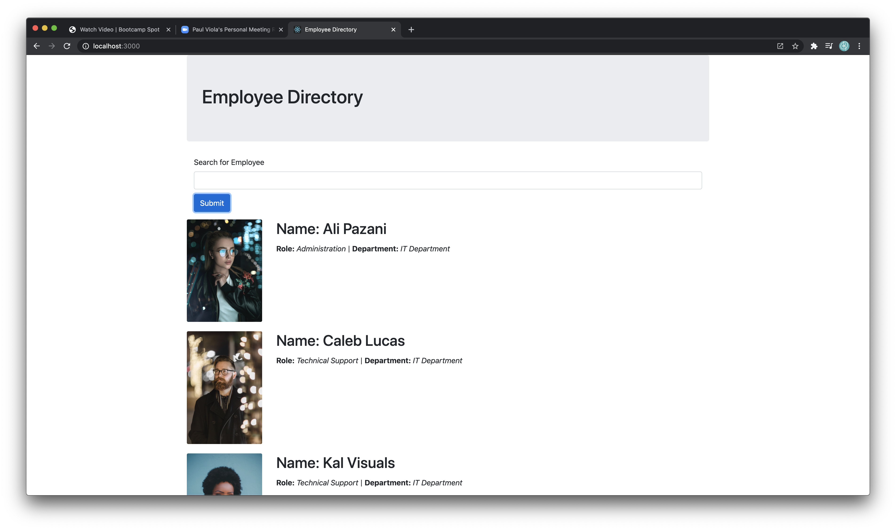
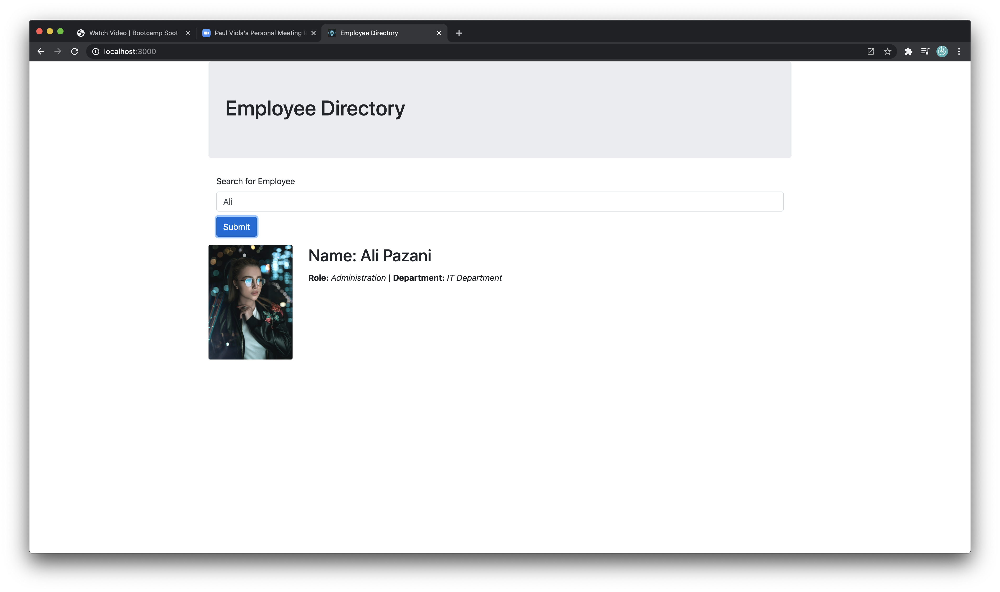
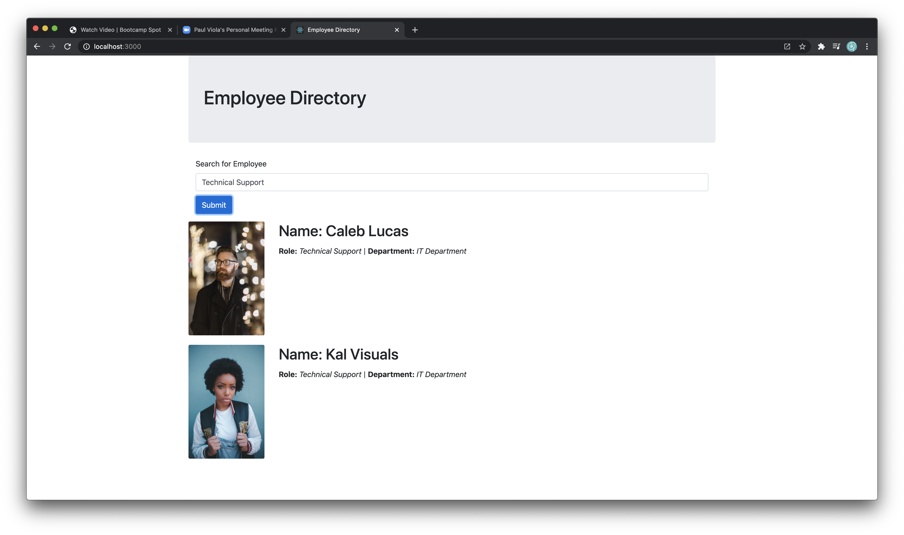

  # Project: Employee Directory
  

  # Description: 
  This application allows the user to search through a list of employees by using their first or last name, role, or department.
  
  # Table of Contents:
  
  * [Title](#Project)
  * [Description](#Description)
  * [Installation](#Installation) 
  * [Usage](#User-Story)
  * [What is Next](#What-is-Next)
  * [What I learned](#What-I-Learned) 
  * [Questions](#Questions)
  * [Useful Links](#Useful-Links)
  
  

  # Installation 
  This is an ReactJS app and uses bootstrap, react, react-dom, and react-scripts

  # User-Story 
  When the user launches the application, they can input the contact they would like to search for, and the information will show accordingly. The user can search by first name, last name, role, or department.

  

  # What is Next 
  I have three main tasks I would like to work on to complete this assignment:
I want to be to add a filter function that could filter by role.
I want to convert the search input to lower case letters to lessen the margin for error when the user inputs a request.
I want to add a feature that the complete list of employees is replaced when the search input is cleared. 

  # What I learned 
  While working on this assignment, I gained a clear understanding of the basics of reacting. I learned how to create components appropriately and then how to add props to those components. 

  

  # Questions 
  Github Username: kecoston If you have any question, you can email me at: kecoston@gmail.com

  # Useful Links

  GitHub Repository: https://github.com/kecoston/employee-directory
  
  Deployed Link:
  
  Video of Application: https://drive.google.com/file/d/1L5hWqAOcHbintpsAsF8ws47PYj_X2zXO/view

  # Licensing 

  Employee Directory  Copyright (C) 2020 kecoston

  